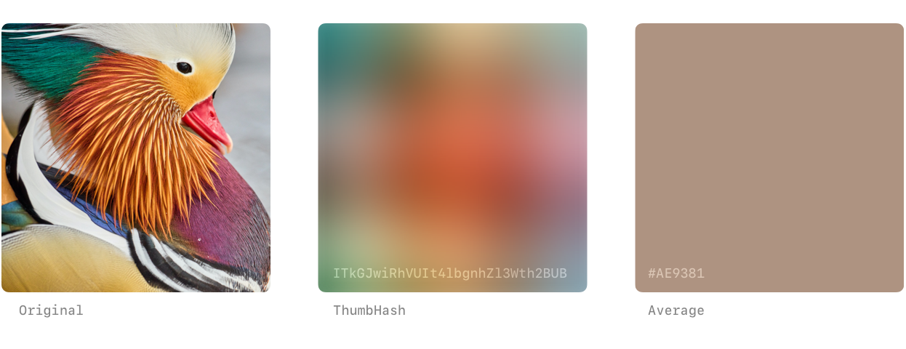

# WP Thumbhash

<!---->

**A WordPress plugin that automatically generates and displays thumbhash placeholders for your lazy-loaded images 🦦**

## Docs
- [**🔌 Installation**](./docs/INSTALLATION.md)
- [**💡 Usage**](./docs/USAGE.md)
- [**📚 Changelog**](./CHANGELOG.md)

## Attribution

**wp-thumbhash** draws heavy inspiration from the [Statamic Placeholder Images](https://github.com/daun/statamic-placeholders) addon, even using the same hero image with permission. Also, special thanks to [Evan Wallace](https://github.com/evanw/thumbhash) for the original ThumbHash algorithm.
